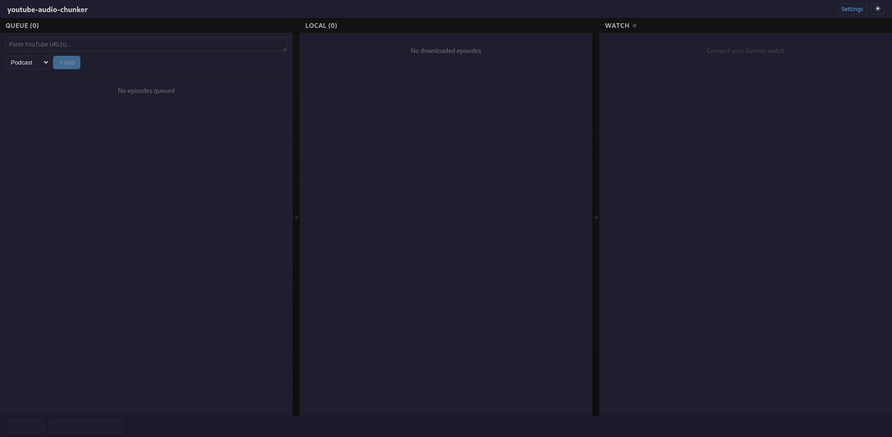

# youtube-audio-chunker

Download YouTube audio, split into navigable chunks, and sideload to Garmin watches.

Built for the Garmin Forerunner 245 Music (and similar watches that play MP3s via USB/MTP).

## Desktop app



A Tauri desktop app provides a three-column dashboard for managing your audio pipeline:

- **Queue** - paste YouTube URLs, pick a content type, and add to the queue
- **Local** - downloaded and chunked episodes stored on disk
- **Watch** - episodes on the connected Garmin, with storage bar and per-episode delete

The app includes light/dark theme toggle, real-time progress tracking, configurable settings (chunk duration, default content type, artist name), and space management for the watch.

### Running the desktop app

```bash
cd gui
npm install
npx tauri dev
```

Requires [Rust](https://rustup.rs/) and the [Tauri prerequisites](https://v2.tauri.app/start/prerequisites/) in addition to the Python backend.

### Tech stack

- **Frontend** - SvelteKit (Svelte 5) with CSS custom properties theming
- **Backend** - Tauri v2 (Rust) wrapping the Python CLI as a sidecar process
- **Audio processing** - Python CLI using yt-dlp and ffmpeg

## CLI

The full workflow is also available from the command line.

### Prerequisites

- Python 3.11+
- [ffmpeg](https://ffmpeg.org/) (system package)
- [yt-dlp](https://github.com/yt-dlp/yt-dlp) (installed as dependency)

### Installation

```bash
pip install -e .
```

For development:

```bash
pip install -e ".[dev]"
```

### Quick start

```bash
# Download a video, chunk it, and transfer to watch - all in one step
youtube-audio-chunker download "https://www.youtube.com/watch?v=VIDEO_ID"
```

### Usage

Run `youtube-audio-chunker --help` for full details, or `youtube-audio-chunker <command> --help` for command-specific options.

#### Add videos to the queue

```bash
youtube-audio-chunker add "https://www.youtube.com/watch?v=VIDEO_ID"
youtube-audio-chunker add "https://www.youtube.com/playlist?list=PLAYLIST_ID"
```

Playlists are expanded to individual entries. Duplicates are skipped.

#### Content types

Use `--type` with `add` or `download` to control chunking and destination folder:

| Type | Chunking | Garmin folder |
|------|----------|---------------|
| `music` (default) | 5-min chunks | `Music/` |
| `podcast` | Single file | `Podcasts/` |
| `audiobook` | Single file | `Audiobooks/` |

```bash
youtube-audio-chunker add --type podcast "https://www.youtube.com/watch?v=VIDEO_ID"
youtube-audio-chunker download --type audiobook "https://www.youtube.com/watch?v=VIDEO_ID"
```

#### Process queue and sync to watch

```bash
# Process and transfer to Garmin
youtube-audio-chunker sync

# Process only (no watch needed)
youtube-audio-chunker sync --no-transfer

# Custom chunk duration (10 minutes)
youtube-audio-chunker sync --chunk-duration 600

# Override artist tag
youtube-audio-chunker sync --artist "Podcast Host"
```

#### Transfer to watch

```bash
# Re-transfer any episodes not yet on the watch
youtube-audio-chunker transfer
```

#### List episodes

```bash
youtube-audio-chunker list            # Show all sections
youtube-audio-chunker list --queued   # URLs waiting to be processed
youtube-audio-chunker list --local    # Downloaded and chunked locally
youtube-audio-chunker list --watch    # On the Garmin watch
```

#### Remove episodes

```bash
youtube-audio-chunker remove "Episode Title"          # Remove from local storage
youtube-audio-chunker remove "Episode Title" --watch   # Remove from watch only
```

## How it works

1. **Download** - yt-dlp extracts audio as 128kbps MP3
2. **Split** - ffmpeg segments into 5-minute chunks (lossless, no re-encoding)
3. **Tag** - ID3v2 tags set per chunk (title, album, artist, track number) so they play in order
4. **Transfer** - copies to the appropriate folder on the mounted Garmin via MTP

Files are stored in `~/.youtube-audio-chunker/`.

## Running tests

```bash
pytest tests/
```
