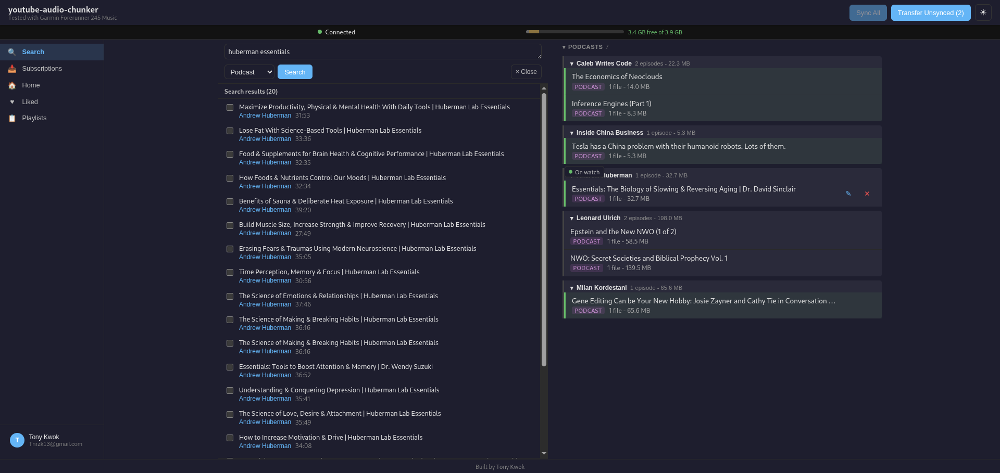

# youtube-audio-chunker

Download YouTube audio, split into navigable chunks, and sideload to Garmin watches.

Tested on the Garmin Forerunner 245 Music. Should work with any Garmin watch that supports music via USB/MTP (Forerunner 265/965, Venu series, fenix, epix, etc.).

## Desktop app

| Light | Dark |
|-------|------|
|  |  |

A Tauri desktop app with a sidebar-driven layout for managing your audio pipeline:

- **YouTube account feeds** - connect your YouTube account via browser cookies to browse subscriptions, home feed, liked videos, and playlists directly from the app
- **Search and browse** - search YouTube or browse a channel's videos; results appear in a two-column layout alongside your library
- **Add form** - paste YouTube URLs, pick a content type (music/podcast/audiobook), and queue downloads
- **Episode list** - all episodes in one view, grouped by content type and show name, with collapsible sections and show groups (state persists across sessions)
- **Sync status** - color-coded left borders indicate episode state: green = on watch, blue = processing
- **Garmin status strip** - compact connection indicator with inline storage bar
- **Device-only episodes** - episodes on the watch but not in the local library appear in a separate section

Editing an episode's metadata (title, show, artist, content type) re-tags the local MP3 files. If the episode is already on the watch, it automatically re-syncs - removing the old copy and transferring the updated files to the correct Garmin folder.

The app includes light/dark theme toggle, real-time progress tracking, configurable settings (chunk duration, default content type, artist name), and space management for the watch.

### Installing the desktop app

Run the setup script to check and install all dependencies automatically:

```bash
./setup.sh
```

Then build an installable package with:

```bash
cd gui
npm install
npm run tauri build
```

Requires [Rust](https://rustup.rs/) and the [Tauri prerequisites](https://v2.tauri.app/start/prerequisites/) in addition to the Python backend.

**Linux** - installs via the `.deb` package, which adds the app to your launcher:

```bash
sudo dpkg -i src-tauri/target/release/bundle/deb/*.deb
```

An AppImage is also produced at `src-tauri/target/release/bundle/appimage/` if you prefer a portable executable that requires no installation.

**macOS** - installs via the `.dmg`:

```bash
open src-tauri/target/release/bundle/dmg/*.dmg
```

Drag the app to your Applications folder, then launch it from Spotlight or Finder.

### Running in development mode

```bash
cd gui
npm install
npx tauri dev
```

### Tech stack

- **Frontend** - SvelteKit (Svelte 5) with CSS custom properties theming
- **Backend** - Tauri v2 (Rust) wrapping the Python CLI as a sidecar process
- **Audio processing** - Python CLI using yt-dlp and ffmpeg

## CLI

The full workflow is also available from the command line.

### Prerequisites

- Python 3.11+
- [ffmpeg](https://ffmpeg.org/) (system package)
- [yt-dlp](https://github.com/yt-dlp/yt-dlp) (installed as dependency)

### Installation

```bash
pip install -e .
```

For development:

```bash
pip install -e ".[dev]"
```

### Quick start

```bash
# Download a video, chunk it, and transfer to watch - all in one step
youtube-audio-chunker download "https://www.youtube.com/watch?v=VIDEO_ID"
```

### Usage

Run `youtube-audio-chunker --help` for full details, or `youtube-audio-chunker <command> --help` for command-specific options.

#### Add videos to the queue

```bash
youtube-audio-chunker add "https://www.youtube.com/watch?v=VIDEO_ID"
youtube-audio-chunker add "https://www.youtube.com/playlist?list=PLAYLIST_ID"
```

Playlists are expanded to individual entries. Duplicates are skipped.

#### Content types

Use `--type` with `add` or `download` to control chunking and destination folder:

| Type | Chunking | Garmin folder |
|------|----------|---------------|
| `music` (default) | 5-min chunks | `Music/` |
| `podcast` | Single file | `Podcasts/` |
| `audiobook` | Single file | `Audiobooks/` |

```bash
youtube-audio-chunker add --type podcast "https://www.youtube.com/watch?v=VIDEO_ID"
youtube-audio-chunker download --type audiobook "https://www.youtube.com/watch?v=VIDEO_ID"
```

#### Process queue and sync to watch

```bash
# Process and transfer to Garmin
youtube-audio-chunker sync

# Process only (no watch needed)
youtube-audio-chunker sync --no-transfer

# Custom chunk duration (10 minutes)
youtube-audio-chunker sync --chunk-duration 600

# Override artist tag
youtube-audio-chunker sync --artist "Podcast Host"
```

#### Transfer to watch

```bash
# Re-transfer any episodes not yet on the watch
youtube-audio-chunker transfer
```

#### List episodes

```bash
youtube-audio-chunker list            # Show all sections
youtube-audio-chunker list --queued   # URLs waiting to be processed
youtube-audio-chunker list --local    # Downloaded and chunked locally
youtube-audio-chunker list --watch    # On the Garmin watch
```

#### Edit episode metadata

```bash
youtube-audio-chunker edit VIDEO_ID --show "New Show"
youtube-audio-chunker edit VIDEO_ID --artist "New Artist" --title "New Title"
youtube-audio-chunker edit VIDEO_ID --type podcast
```

Updates ID3 tags on the local MP3 files. Use `list --local` to find the video ID.

#### Remove episodes

```bash
youtube-audio-chunker remove "Episode Title"          # Remove from local storage
youtube-audio-chunker remove "Episode Title" --watch   # Remove from watch only
```

## How it works

1. **Download** - yt-dlp extracts audio as 128kbps MP3
2. **Split** - ffmpeg segments into 5-minute chunks (lossless, no re-encoding)
3. **Tag** - ID3v2 tags set per chunk (title, album, artist, track number) so they play in order
4. **Transfer** - copies to the appropriate folder on the mounted Garmin via MTP

Files are stored in `~/.youtube-audio-chunker/`.

## Running tests

```bash
pytest tests/
```
